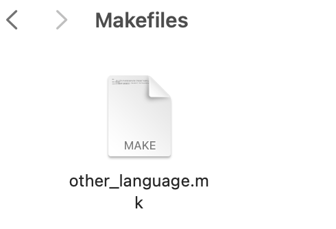

# Ambulance Pickup Problem

## Description:

The ambulance planning real-time problem is to rescue as many people as possible following a disaster. The problem statement identifies the locations of people and the time they have to live. You can also establish mobile hospitals at the beginning of the problem. The problem is to get as many people to the hospitals on time as possible.

In our case, the graph is the Manhattan grid with every street going both ways. It takes a minute to go one block either north-south or east-west. Each hospital has an (x,y) location that you can determine when you see the distribution of victims. The ambulances need not return to the hospital where they begin. Each ambulance can carry up to four people. It takes one minute to load a person and one minute to unload up to four people. Each person will have a rescue time which is the number of minutes from now when the person should be unloaded in the hospital to survive. By the way, this problem is very similar to the vehicle routing problem about which there is an enormous literature and nice code like "jsprit" which was used in 2015 to great effect.

The input data is in the form:
```angular2html
person(xloc,yloc,rescuetime)
1,1,10
...
...
2,2,20

hospital(numambulance)
1
2
3
```
## Contact:

```angular2html
Yue Han(If you find any bugs please reach me first :))
Email: yh5404@nyu.edu
Shichu Chen
Email: sc10740@nyu.edu
```

## Notes:

   1. You are responsible to check for the order in which the ambulances are departed. 
i.e. if A has 3 ambulances, there is a path B -> A making 4 total at A, 
you will need to print the result B -> A before departing the 4th ambulance from A.
   2. If in your route, while you are still driving to some person but they already passed away, the program will still count the whole time of the trip and return that some of the people didn't make it.
   3. When allocating one ambulance in a hospital, it will send the one which ended its last tour firstly.
   4. Other details please refer to the code and explanation.
   5. If you run into any format issues, the program will only leave an error output, but NOT stop the execution.
Even if your output is being validated, it may have some errors printed (Sample output has few such errors displayed)
   6. If you find any bugs in the code, feel free to let us know, and we'll fix it for you.
   7. When you finish, you could make your submissions to the emails above so that we could help to get back to you incase there is any error in compiling your code.
   8. If the visualization is not showed with some error, you may try to configure `matplotlib` in the terminal or just comment out below to get rid of it. 
```python
    # Read results for visualization
    paths = readresults(persons, hospitals, result_file)  # Get paths after processing results

    # After processing results, visualize the paths
    visualize_ambulance_paths(paths, hospitals, persons)
```


The `read_data()` returns the list of **objects** and not a dictionary. 
You can use `object.prettify()` to get the dictionary instead, or add another function as per your requirements.

## For Python users

### coding
Place your logic in `my_solution()` in `total.py` and write results into a `[teamname].txt` in format below.

```angular2html
H1:x_coordinate,y_coordinate
...
H3:x_coordinate,y_coordinate

Start_Time H1 P1 P2 ... PN H2  
...
Start_Time H3 P1 P3 ... PN H2
```
You can refer to the `sample_result.txt` to get the idea. The sample result is NOT optimal by any means. `bad_result.txt` shows examples of lines with bad format. 

### validation and visualization
Under the `HPS-ambulance-pickup-architecture-main` folder in terminal, type
```python
python3 total.py input_data.txt [teamname].txt
```
It will generate the `[teamname].txt` following your solution and validate and visualize it afterwards.
If you have generated the result `[teamname].txt`, you can also call
```python
python3 total.py input_data.txt [teamname].txt
```
it will help you validate the result file anyway.

## For other Language users:

### writing code and validate locally

1. Write your solution file `[team_name_algorithm].extension` with an input parameter like below (in cpp):
```
int main(int argc, char* argv[])
```
and write your answer also into the format like above and generate a result file named `[teamname].txt`.
Similarly, if you have generated the result `[teamname].txt`, you can call
```python
python3 total.py input_data.txt [teamname].txt
```
it will help you validate the result file anyway.

### For contest day

Please write a makefile under path `Makefiles/[teamname].mk` which could generate the result file `[teamname].txt` finally.
Here is an example makefile:
```python 
make:
	clear  # Clear the terminal screen to have a clean view of new output
	g++ -std=c++11 Solutions/[team_name]_algorithm.cpp -o [team_name]  # Compile the C++ file, producing an executable named [team_name]
	./[team_name] input_data.txt > [team_name].txt  # Run the executable with input_data.txt as input and redirect the output to [team_name].txt
```
And then under the `HPS-ambulance-pickup-architecture-main` folder in terminal, type
```python
python3 driver.py
```
## Submission
Please submit a **folder** named after your **teamname** with:
### python user
just one `total.py` with your solution in it.
### other language user
1. `team_name_algorithm.extension`
2. a folder named `Makefiles` with only your `[teamname].mk` in it like below.

